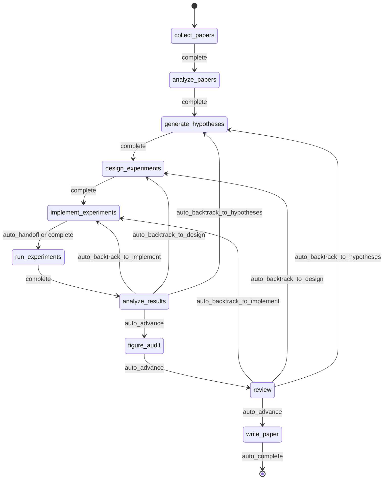

<div align="center">

  <br/>

  

  <h1>Codex-Native Research Governance Layer</h1>

  <p><strong>Evidence gates for Codex and external research agents.</strong><br/>
  Governed, checkpointed, inspectable research work from brief to paper-readiness review.</p>

  <p>
    <a href="./README.md"><strong>English</strong></a>
    &nbsp;&middot;&nbsp;
    <a href="./docs/README.ko.md"><strong>한국어</strong></a>
    &nbsp;&middot;&nbsp;
    <a href="./docs/README.ja.md"><strong>日本語</strong></a>
    &nbsp;&middot;&nbsp;
    <a href="./docs/README.zh-CN.md"><strong>简体中文</strong></a>
    &nbsp;&middot;&nbsp;
    <a href="./docs/README.zh-TW.md"><strong>繁體中文</strong></a>
    &nbsp;&middot;&nbsp;
    <a href="./docs/README.es.md"><strong>Español</strong></a>
    &nbsp;&middot;&nbsp;
    <a href="./docs/README.fr.md"><strong>Français</strong></a>
    &nbsp;&middot;&nbsp;
    <a href="./docs/README.de.md"><strong>Deutsch</strong></a>
    &nbsp;&middot;&nbsp;
    <a href="./docs/README.pt.md"><strong>Português</strong></a>
    &nbsp;&middot;&nbsp;
    <a href="./docs/README.ru.md"><strong>Русский</strong></a>
  </p>

  <p><sub>Localized README files are maintained translations of this document. The English README is updated first.</sub></p>

  <p>
    <a href="https://github.com/lhy0718/AutoLabOS/actions/workflows/ci.yml">
      
    </a>
    <a href="https://github.com/lhy0718/AutoLabOS/actions/workflows/smoke.yml">
      
    </a>
    
  </p>

  <p>
    
    
    
  </p>

  <p>
    
    
    
    
  </p>

</div>

---

AutoLabOS is a Codex-native governance harness for research execution. It treats Codex and external research agents as execution engines, while AutoLabOS owns the artifact, gate, review, downgrade, and paper-readiness contract.

The reference TUI/web workflow remains inspectable end to end: literature collection, hypothesis formation, experiment design, execution, analysis, figure audit, review, and manuscript drafting all produce auditable artifacts. Claims stay evidence-bounded through a claim ceiling. Review is a structural gate, not a polish pass.

Quality assumptions are turned into explicit checks. Real behavior matters more than prompt-level appearance. Reproducibility is enforced through artifacts, checkpoints, and inspectable transitions.

---

## Codex Plugin Direction

AutoLabOS is moving to a plugin-first public surface. The repo-local plugin bundle lives at `plugins/autolabos-research-governor/` and exposes the governance layer as Codex skills rather than as a monolithic autonomous scientist.

The plugin contract is artifact-first:

`ResearchBrief` -> `EvidenceBundle` -> `GateReport` -> `ReviewReport` -> `MetaHarnessPatchPlan` -> `PaperReadinessBundle`

The existing standalone TUI and web app stay important as a reference workflow, compatibility shell, and validation environment. They are no longer the only product shape: external agents can execute work, then AutoLabOS audits the resulting artifacts before any paper-readiness claim is allowed.

For first-run plugin checks:

```sh
npm run plugin:contract
npm run plugin:dogfood
npm run plugin:doctor
npm run plugin:doctor -- --strict
npm run plugin:discovery-check
npm run validate:plugin-bridge
npm run validate:plugin-bridge:local
npm run validate:plugin-faults
npm run validate:plugin-hermetic
npm run validate:plugin-operations
npm run validate:plugin-operations:local
npm run plugin:sync-cache
npm run plugin:release-check
npm run plugin:research -- --check
npm run plugin:research -- verify-pack --root <paper-readiness-bundle-dir>
```

Use `npm run plugin:doctor -- --strict` for CI or release checks that should fail on installed cache drift. Use `npm run plugin:discovery-check` on a Codex-enabled workstation to verify local discovery, enablement, manifest version, repository source, cache, and skill alignment. Use `npm run validate:plugin-bridge` for the deterministic CI-safe bridge acceptance and `npm run validate:plugin-bridge:local` to execute the same governed chain through the installed Codex plugin cache. Use `npm run validate:plugin-faults` for deterministic blocking-path coverage, `npm run validate:plugin-hermetic` for an isolated cache lifecycle, `npm run validate:plugin-operations` for the CI aggregate, and `npm run validate:plugin-operations:local` for the workstation aggregate. Use `npm run plugin:sync-cache -- --write` only when intentionally refreshing the local Codex installation, then run `npm run plugin:release-check`. The plugin-specific onboarding note is `plugins/autolabos-research-governor/README.md`.

See `docs/codex-plugin-governance.md` for the plugin architecture and adapter strategy.

## Why AutoLabOS Exists

Most research-agent systems are optimized around producing text. AutoLabOS is optimized around running a governed research process.

That difference matters when a project needs more than a plausible-looking draft:

- a research brief that acts as an execution contract
- explicit workflow gates instead of open-ended agent drift
- checkpoints and artifacts that can be inspected after the fact
- review that can stop weak work before manuscript generation
- failure memory so the same failed experiment is not repeated blindly
- evidence-bounded claims rather than prose that outruns the data

AutoLabOS is for teams that want autonomous help without giving up auditability, backtracking, or validation.

---

## What Happens In The Reference Workflow

The reference workflow follows the same research arc every time:

`Brief.md` → literature → hypothesis → experiment design → implementation → execution → analysis → figure audit → review → manuscript

In practice:

1. `/new` creates or opens a research brief.
2. `/brief start --latest` validates the brief, snapshots it into the run, and launches a governed run.
3. The system moves through the fixed research workflow, checkpointing state and artifacts at each boundary.
4. Weak evidence triggers backtracking or downgrade instead of automatic polishing.
5. If the review gate passes, `write_paper` drafts a manuscript from bounded evidence.

In the current runtime, `figure_audit` sits between `analyze_results` and `review` so figure-quality critique can checkpoint and resume independently.



All automation inside that flow is bounded inside node-internal loops. The workflow stays governed even in unattended modes.

---

## What You Get After A Run

AutoLabOS does not just emit a PDF. It emits a traceable research state.

| Output | What it contains |
|---|---|
| **Literature corpus** | Collected papers, BibTeX, extracted evidence store |
| **Hypotheses** | Literature-grounded hypotheses with skeptical review |
| **Experiment plan** | Governed design with contract, baseline lock, and consistency checks |
| **Executed results** | Metrics, objective evaluation, failure memory log |
| **Result analysis** | Statistical analysis, attempt decisions, transition reasoning |
| **Figure audit** | Figure lint, caption/reference consistency, optional vision critique summary |
| **Review packet** | 5-specialist panel scorecard, claim ceiling, pre-draft critique |
| **Manuscript** | LaTeX draft with evidence links, scientific validation, optional PDF |
| **Checkpoints** | Full state snapshots at every node boundary — resume anytime |

Everything lives under `.autolabos/runs/<run_id>/`, with public-facing outputs mirrored to `outputs/`.

That is the reproducibility model: artifacts, checkpoints, and inspectable transitions rather than hidden state.

---

## Quick Start

```bash
# 1. Install and build
npm install
npm run build
npm link

# 2. Move to a research workspace
cd /path/to/your-research-workspace

# 3. Launch one interface
autolabos        # TUI
autolabos web    # Web UI
```

Typical first-use flow:

```bash
/new
/brief start --latest
/doctor
```

Notes:

- Both UIs guide onboarding if `.autolabos/config.yaml` does not exist yet.
- TUI and Web UI share the same runtime, artifacts, and checkpoints.

### Prerequisites

| Item | When needed | Notes |
|---|---|---|
| `SEMANTIC_SCHOLAR_API_KEY` | Always | Paper discovery and metadata |
| `OPENAI_API_KEY` | When provider is `api` | OpenAI API model execution |
| Codex CLI login | When provider is `codex` | Uses your local Codex session |

---

## Research Brief System

The brief is not just a startup note. It is the governed contract for a run.

`/new` creates or opens `Brief.md`. `/brief start --latest` validates it, snapshots it into the run, and starts execution from that snapshot. The run records the brief source path, the snapshot path, and any parsed manuscript format so the provenance of the run remains inspectable even if the workspace brief changes later.
`Appendix Preferences` can now be structured with `Prefer appendix for:` and `Keep in main body:` so appendix-routing intent is explicit in the brief contract.

That makes the brief part of the audit trail, not just part of the prompt.

In practice, `.autolabos/config.yaml` holds provider and workspace defaults, while the brief carries run-specific research intent, evidence bars, baseline expectations, manuscript-format targets, and manuscript template path.

```bash
/new
/brief start --latest
```

Briefs are expected to define both research intent and governance constraints: topic, objective metric, baseline or comparator, minimum acceptable evidence, disallowed shortcuts, and the paper ceiling if evidence remains weak.

<details>
<summary><strong>Brief sections and grading</strong></summary>

| Section | Status | Purpose |
|---|---|---|
| `## Topic` | Required | Research question in 1-3 sentences |
| `## Objective Metric` | Required | Primary success metric |
| `## Constraints` | Recommended | Compute budget, dataset limits, reproducibility rules |
| `## Plan` | Recommended | Step-by-step experiment plan |
| `## Target Comparison` | Governance | Proposed method vs. explicit baseline |
| `## Minimum Acceptable Evidence` | Governance | Minimum effect size, fold count, decision boundary |
| `## Disallowed Shortcuts` | Governance | Shortcuts that invalidate results |
| `## Paper Ceiling If Evidence Remains Weak` | Governance | Maximum paper classification if evidence is insufficient |
| `## Manuscript Format` | Optional | Column count, page budget, reference/appendix rules |

| Grade | Meaning | Paper-scale ready? |
|---|---|---|
| `complete` | Core + 4+ governance sections substantive | Yes |
| `partial` | Core complete + 2+ governance | Proceed with warnings |
| `minimal` | Only core sections | No |

</details>

---

## Two Interfaces, One Runtime

AutoLabOS has two front ends over the same governed runtime.

| | TUI | Web UI |
|---|---|---|
| Launch | `autolabos` | `autolabos web` |
| Interaction | Slash commands, natural language | Browser dashboard and composer |
| Workflow view | Real-time node progress in terminal | Governed workflow graph with actions |
| Artifacts | CLI inspection | Inline preview for text, images, PDFs |
| Operations surfaces | `/watch`, `/queue`, `/explore`, `/doctor` | Jobs queue, live watch cards, exploration status, diagnostics |
| Best for | Fast iteration and direct control | Visual monitoring and artifact browsing |

The important constraint is that both surfaces see the same checkpoints, the same runs, and the same underlying artifacts.

---

## What Makes AutoLabOS Different

AutoLabOS is designed around governed execution rather than prompt-only orchestration.

| | Typical research tools | AutoLabOS |
|---|---|---|
| Workflow | Open-ended agent drift | Governed fixed graph with explicit review boundaries |
| State | Ephemeral | Checkpointed, resumable, inspectable |
| Claims | As strong as the model will generate | Bounded by evidence and a claim ceiling |
| Review | Optional cleanup pass | Structural gate that can block writing |
| Failures | Forgotten and retried | Fingerprinted in failure memory |
| Interfaces | Separate code paths | TUI and Web share one runtime |

This is why the system reads more like research infrastructure than a paper generator.

---

## Core Guarantees

### Governed Workflow

The workflow is bounded and auditable. Backtracking is part of the contract. Results that do not justify forward motion are sent back to hypotheses, design, or implementation rather than polished into stronger prose.

### Checkpointed Research State

Every node boundary writes state you can inspect and resume. The unit of progress is not only text output. It is a run with artifacts, transitions, and recoverable state.

### Claim Ceiling

Claims are kept under the strongest defensible evidence ceiling. The system records blocked stronger claims and the evidence gaps required to unlock them.

### Review As A Structural Gate

`review` is not a cosmetic cleanup stage. It is where readiness, methodology sanity, evidence linkage, writing discipline, and reproducibility handoff are checked before manuscript generation.

### Failure Memory

Failure fingerprints are persisted so structural errors and repeated equivalent failures are not retried blindly.

### Reproducibility Through Artifacts

Runs stay inspectable because the system persists artifacts, checkpoints, and transitions instead of relying on hidden state.

For a history-free release of the reviewed current revision, follow
[`docs/public-source-release.md`](docs/public-source-release.md). A source
snapshot and cleanup of an existing public Git history are separate operations.


---

## Quality Model

AutoLabOS makes quality checks visible during a run.

- `/doctor` checks environment and workspace readiness before a run starts

Paper readiness is not a single binary prompt judgment.

- **Layer 1 - deterministic minimum gate** blocks under-evidenced work with explicit artifact and evidence-integrity checks
- **Layer 2 - LLM paper-quality evaluator** adds structured critique over methodology, evidence strength, writing structure, claim support, and limitations honesty
- **Review packet + specialist panel** determine whether the manuscript path should advance, revise, or backtrack

`paper_readiness.json` can include an `overall_score`. It should be read as a run-quality signal inside the system, not as a universal scientific benchmark. Some advanced evaluation and self-improvement flows use that score to compare runs or candidate prompt mutations.

---

## Advanced Self-Improvement Capabilities

AutoLabOS includes bounded self-improvement paths, but they are governed by validation and rollback rather than blind autonomous rewriting.

### `autolabos meta-harness`

`autolabos meta-harness` builds a context directory from recent completed runs and evaluation history under `outputs/meta-harness/<timestamp>/`.

It can include:

- filtered run events
- node artifacts such as `result_analysis.json` or `review/decision.json`
- `paper_readiness.json`
- `outputs/eval-harness/history.jsonl`
- current `node-prompts/` files for the targeted node

The LLM is instructed through `TASK.md` to return only `TARGET_FILE + unified diff`, and the target is constrained to `node-prompts/`. In apply mode, the candidate must pass validation checks; otherwise the change is rolled back and an audit log is written. `--no-apply` builds context only. `--dry-run` shows the diff without modifying files.

### `autolabos evolve`

`autolabos evolve` runs a bounded mutation-and-evaluation loop over `.codex` and `node-prompts`.

- supports `--max-cycles`, `--target skills|prompts|all`, and `--dry-run`
- reads run fitness from `paper_readiness.overall_score`
- can mutate prompts and skills, run validation, and compare fitness across cycles
- rolls back regressions by restoring `.codex` and `node-prompts` from the last good git tag

This is a self-improvement path, but not an unconstrained repo-wide rewrite path.

### Harness Preset Layer

AutoLabOS also has built-in harness presets such as `base`, `compact`, `failure-aware`, and `review-heavy`. These adjust artifact/context policy, failure-memory emphasis, prompt policy, and compression strategy for comparative evaluation paths without changing the governed production workflow.

### Reference Claim Review

Citation-bearing claims can be handed to an independent human reviewer without
placing third-party full text in a public packet. The preflight produces a
separate incomplete final-approval template. Only an all-supported review plus
a completed human approval can generate an import-candidate claims TSV:

```sh
autolabos reference-review prepare \
  --claims <refgate_claims.tsv> \
  --status <reference-evidence-status.json> \
  --lock <refgate.lock.json> \
  --out-dir <new-handoff-dir>

autolabos reference-review distribute-private \
  --packet <handoff-dir> \
  --source-dir <citation-key-named-full-text-dir> \
  --out-dir <new-private-distribution-dir>

autolabos reference-review preflight \
  --packet <handoff-or-private-distribution-dir> \
  --review <completed-review.json> \
  --out-dir <new-preflight-dir>

autolabos reference-review import \
  --packet <handoff-or-private-distribution-dir> \
  --review <completed-review.json> \
  --preflight <new-preflight-dir>/reference-claim-review-preflight.json \
  --approval <completed-final-approval.json> \
  --claims <refgate_claims.tsv> \
  --out-dir <new-import-dir>
```

The import revalidates the closed packet, review, preflight, approval, and
original claims hash. It writes `refgate_claims.reviewed.tsv` and a hash-bound
receipt to a new directory; it never overwrites the source claims file. Claims
omitted because their full text is missing remain unchecked. The candidate TSV
must pass a separate Refgate submission audit before it is adopted.

### Research Milestone Verification

Long-running research can bind its final requirements to a declarative artifact
contract instead of inferring completion from workflow state:

```sh
autolabos research verify-milestone \
  --contract <milestone.json> \
  --out-dir <new-audit-dir>
```

Each required evidence file must stay inside the declared workspace root and
carry an expected SHA-256 in the contract. Missing, empty, symbolic-link,
unbound, rewritten, or assertion-failing evidence keeps the milestone
incomplete. The report groups failed requirements by their declared workflow
node and exits nonzero until every required item passes.

A passing artifact audit establishes only the declared byte and JSON contracts.
It does not independently prove scientific validity, human identity, provider
identity, or statistical independence.

### Research Validation Profiles

Run a repository-owned, hash-bound command profile when a paper-scale revision
needs one auditable receipt for build, tests, harness, smoke, plugin, environment,
isolated paper-build, and page-render checks:

```sh
autolabos research run-validation \
  --profile <validation-profile.json> \
  --out-dir <new-validation-dir>
```

Profiles declare every required step as a command plus argument vector; shell
strings and undeclared environment overrides are not used. The runner records
the profile hash, exit code, timeout, duration, stdout/stderr hashes, declared
output hashes, and Git state before and after execution. Missing required steps,
missing outputs, command failures, a changed Git HEAD, or a dirty worktree keep
the report failed. Command success establishes only the declared validation
surface and never substitutes for scientific, human-review, licensing,
reference, or paper-readiness evidence.

### External Source Projection

External research-agent outputs can be normalized for promotion-benchmark intake without embedding source-specific adapters in public runtime code:

```sh
autolabos governance-benchmark audit-promotion-source-expansion \
  --inventory <source-inventory.json> \
  --out-dir <new-audit-dir>

autolabos governance-benchmark export-promotion-trial-candidates \
  --recipe <source-recipe.json> \
  --source-root <pinned-local-source> \
  --out-dir <new-handoff-dir>

autolabos governance-benchmark prepare-promotion-trial-candidate-review-campaign \
  --handoff-root <new-handoff-dir> \
  --annotator-id <reviewer-a-pseudonym> \
  --annotator-id <reviewer-b-pseudonym> \
  --license-reviewer-id <license-reviewer-pseudonym> \
  --out-dir <new-review-campaign>

autolabos governance-benchmark prepare-promotion-trial-candidate-worksheet \
  --handoff-root <new-handoff-dir> \
  --annotator-id <pseudonym> \
  --output <review-a.json>

autolabos governance-benchmark prepare-promotion-trial-candidate-review-workspace \
  --package-root <new-review-campaign>/reviewer-a \
  --out-dir <reviewer-a-workspace>

autolabos governance-benchmark audit-promotion-trial-candidate-review-workspace \
  --workspace-root <reviewer-a-workspace> \
  --out-dir <new-workspace-audit>

autolabos governance-benchmark finalize-promotion-trial-candidate-review-workspace \
  --workspace-root <reviewer-a-workspace> \
  --output <review-a.json>

autolabos governance-benchmark prepare-promotion-trial-candidate-license-worksheet \
  --handoff-root <new-handoff-dir> \
  --reviewer-id <pseudonym> \
  --output <license-review.json>

autolabos governance-benchmark preflight-promotion-trial-candidate-annotation \
  --reviewer-root <new-handoff-dir>/reviewer \
  --annotation <review-a.json> \
  --out-dir <preflight-a>

autolabos governance-benchmark preflight-promotion-trial-candidate-license-review \
  --license-root <new-handoff-dir>/license \
  --review <license-review.json> \
  --out-dir <license-preflight>

autolabos governance-benchmark collect-promotion-trial-candidate-review-campaign \
  --campaign-root <new-review-campaign> \
  --handoff-root <new-handoff-dir> \
  --annotation <review-a.json> \
  --annotation <review-b.json> \
  --license-review <license-review.json> \
  --out-dir <campaign-return>

autolabos governance-benchmark adjudicate-promotion-trial-candidate-review \
  --handoff-root <new-handoff-dir> \
  --annotation <review-a.json> \
  --annotation <review-b.json> \
  --license-review <license-review.json> \
  --out-dir <review-adjudication>

autolabos governance-benchmark prepare-promotion-canonical-curation \
  --handoff-root <new-handoff-dir> \
  --campaign-return-root <campaign-return> \
  --curator-id <pseudonym> \
  --verifier-id <different-pseudonym> \
  --curator-protocol <version> \
  --verifier-protocol <version> \
  --out-dir <new-curation-handoff>

autolabos governance-benchmark project-promotion-source \
  --source-root <raw-source> \
  --recipe <projection.json> \
  --out-dir <projected-bundle>
```

The source-expansion audit keeps exact artifact counts, bounded lower bounds, reported aggregate claims, and unestablished observations separate at every stage. Generated research tasks, execution traces, manuscript PDFs, and repository claims can establish source capacity, but none count as confirmatory admissions. Paper-scale source readiness requires at least 72 exactly admitted, source-diverse base bundles after source binding, real execution evidence, repeated trials, comparison results, figure and claim-evidence checks, human license review, and two independent human normalizations. A blocked audit exits nonzero and names the workflow nodes that need more evidence.

The trial-candidate exporter accepts a portable source recipe with a pinned HTTPS Git origin and revision, an anchored path pattern with `operator`, `family`, and `trial` captures, and exactly three trials per base candidate. The machine-local source path is supplied separately through `--source-root`; `source_root` is rejected inside the recipe. The normalized recipe is preserved as the hash-bound `trial-candidate-source-recipe.json` output. Selection is lexical and group-balanced before artifact inspection. Empty and duplicate Git blobs are excluded with explicit accounting. Materialized bytes must match their Git object IDs; credential-like content fails closed, while private machine paths are replaced only in reviewer artifacts with separate raw/reviewer hashes and redaction counts. Give each candidate annotator a separate copy of `reviewer/` only. Its self-contained `reviewer-packet-manifest.json` binds the exact opaque tasks, contracts, and projected artifacts without source, group, or controller metadata. Give a distinct source-license reviewer `license/` only; its `license-packet-manifest.json` binds the exact task and contract, and the task contains the public source URL and revision but no candidate artifacts or annotations. Keep `controller/`, the generated evidence summary, source recipe, and handoff manifest controller-only. Human annotation and source-license review files are external inputs and are never generated by AutoLabOS. A 72-base candidate handoff satisfies only the trace-candidate floor; even a procedurally valid adjudication remains outside canonical normalization and confirmatory admission.

The review-campaign command performs that separation atomically for a paired
72-candidate handoff. It emits two identical opaque reviewer packet snapshots
and one source-license packet, each under a distinct package root with only its
own pseudonymous blank return template. The controller manifest binds every
file and the upstream packet hashes, while packet inspection rejects peer or
controller leakage, changed traces, changed templates, symlinks, extra files,
or reused participant IDs. All observations and the license decision remain
`null`, all human attestations remain `false`, and no adjudication output is
created. Distribute copies of the three package roots separately; keep the
campaign controller directory private.

Use the campaign-return collector for the controller-side return path. It first
revalidates the complete campaign and handoff, matches each returned pseudonym
to its assigned slot, copies the exact return bytes, and binds them to the
adjudication input hashes in `campaign-return-receipt.json`. An unassigned,
duplicated, wrong-handoff, missing, symlinked, or changed return is blocked. A
structurally valid but incomplete template remains an auditable blocked return;
it is never promoted to a completed review. The collector always records
`confirmatory_admitted=false`. The direct adjudication command remains a
lower-level contract and diagnostic surface; by itself it does not establish
that the inputs came from a particular campaign assignment and cannot be used
as the canonical-curation input. Canonical curation accepts only an
integrity-valid, passing campaign return and embeds the complete receipt-bound
return packet so assignment and adjudication provenance can be re-inspected.

The worksheet command copies only opaque candidate IDs into the final annotation
shape. Every observation remains `null`, every rationale is empty, and all
attestations remain `false`; the file therefore fails annotation preflight until
a human reviewer completes it. Run the command separately for each initial
reviewer, keep their files mutually hidden, and never place completed labels
inside the closed handoff directory.

For a large assigned reviewer package, the review-workspace command copies the
integrity-valid opaque packet into a new editable root and splits the blank
template into one file per candidate plus a separate attestation file. The
audit command reports blank, partial, malformed, and structurally complete
counts without treating progress as human evidence. Finalization is refused
until every candidate is structurally complete and all three attestations are
explicitly true. It then assembles the existing monolithic annotation schema;
the resulting file must still pass
`preflight-promotion-trial-candidate-annotation` against the workspace's
`packet/` directory before controller-side collection. Workspace completion
does not prove reviewer identity or independence, validate cited evidence,
compare reviewers, adjudicate labels, or admit confirmatory evidence.

The source-license worksheet is equally fail-closed: its decision starts as
`null`, its evidence and rationale are empty, and all attestations are `false`.
Give it only to the distinct source-license reviewer and keep it separate from
candidate annotations and the controller map. That reviewer can run the
license-review preflight with only the `license/` packet and one review file;
the report checks the packet manifest, hash-bound task, schema, and guide but
cannot grant permission or establish legal authority. Candidate reviewers can
likewise run annotation preflight with only a copied `reviewer/` packet and
their own annotation file. Neither preflight accepts the controller handoff as
its input root.

Projection recipes support byte-for-byte file copies and JSON-pointer extraction only. They cannot add literal evidence values. The projector records source/output hashes, rejects path escape, symlinks, credential-like paths or values, preserves the selected source license, and rejects files added outside the closed output manifest. A generated bundle is marked confirmatory-ready only when the canonical mutation contract, hash-bound real-execution evidence, redistribution declaration, and human license review all pass.

An integrity-valid projection that is not yet canonical can enter a separate blind human-normalization path without being treated as confirmatory-ready:

```sh
autolabos governance-benchmark export-promotion-source-normalization \
  --source-root <projected-bundle> \
  --out-dir <annotation-pack>

autolabos governance-benchmark export-promotion-source-normalization-batch \
  --recipe <batch-recipe.json> \
  --out-dir <review-batch>

autolabos governance-benchmark preflight-promotion-source-normalization-annotation \
  --reviewer-root <review-batch>/reviewer \
  --annotation <labels-a.jsonl> \
  --out-dir <preflight-a>

autolabos governance-benchmark adjudicate-promotion-source-normalization-batch \
  --batch-root <review-batch> \
  --annotations <labels-a.jsonl> \
  --annotations <labels-b.jsonl> \
  --out-dir <adjudication>

autolabos governance-benchmark materialize-promotion-source-normalization-batch \
  --adjudication-root <adjudication> \
  --out-dir <normalized-batch>

autolabos governance-benchmark normalize-promotion-source \
  --source-root <projected-bundle> \
  --map <annotation-pack>/private-normalization-map.json \
  --annotations <labels-a.jsonl> \
  --annotations <labels-b.jsonl> \
  --out-dir <normalized-bundle>
```

The batch recipe is source-neutral:

```json
{
  "schema_version": "1.0",
  "batch_id": "review-batch-a",
  "items": [
    {
      "item_id": "source-item-001",
      "source_root": "outputs/projections/source-item-001",
      "pack_root": "outputs/normalization-packs/source-item-001"
    }
  ]
}
```

Batch export rejects duplicate source hashes or normalization IDs, changed projections, mismatched task maps, absolute paths, and path traversal. It rebuilds the common `RUBRIC.md`, `annotation-schema.json`, `REVIEWER_GUIDE.md`, and required field list from the current runtime contract instead of inheriting stale pack-local instructions. Give each independent reviewer a separate copy of `<review-batch>/reviewer` only. Keep `<review-batch>/controller` private; it reconnects opaque task IDs to source and map paths. Packaging a batch does not prove that reviewers are independent or that any human annotation has occurred.

Each reviewer can run the single-file preflight using only the closed `reviewer` directory and their own JSON Lines file. The preflight verifies the exact distributed schema and guide, records their hashes, checks full opaque-task coverage and one annotator ID, then reports projection, selected-path, result-table, and clean-base materialization findings separately. Use `observation_status=complete` only when every required fact is source-supported. Use `observation_status=insufficient` with null scalar fields and empty collections when evidence is unavailable; never invent sentinel paths, timestamps, identifiers, counts, or success states. A coverage-complete honest insufficient label file can pass submission preflight even when every item is ineligible for clean-base materialization. The command writes no accepted labels, reads no controller map or peer annotation, and does not establish reviewer identity or independence.

Batch adjudication requires two coverage-complete JSON Lines files with one distinct pseudonymous annotator ID per file. It treats `observation_status` as an adjudicated field, preserves that status in accepted labels, reports exact agreement for every normalized field, accepts a third pseudonymous ID only for initial disagreements, and emits per-item materialization inputs only after complete resolution. The report validates record structure and role separation; it does not establish real-world identity, expertise, or independence.

Batch materialization accepts only a passing adjudication directory whose accepted-label and job hashes still match. Every item is reprocessed by the single-source normalizer and independently inspected. Item failures remain in the batch report, and the batch passes only when every source satisfies the execution-evidence, license-scope, and mutation-compatibility gates.

The normalization command requires distinct annotator IDs and exact agreement, or a `--resolution` record from a third ID. It only accepts result, execution, figure, claim, citation, and readiness paths already bound by the projection manifest; the readiness path must be the selected review-decision artifact. The normalized bundle keeps generated canonical fields separate from the nested source, preserves the annotation trace, and independently rechecks source hashes, output closure, execution evidence, license status, and mutation compatibility. Annotator IDs are audit pseudonyms, not proof of real-world identity.

Confirmatory intake requires every projected, normalized, or native bundle to preserve a non-empty `SOURCE_LICENSE.txt`. A successful freeze writes `source_diversity_status=declared_stratified` and carries hashed source-family and operator-group identifiers through recipe, mutation provenance, case manifests, suite loading, adjudication, and scoring. Paper eligibility fails closed when fewer than three families or operator groups are present, one group covers more than half of the bases, or the declarations disappear or conflict across variants.

Confirmatory intake has two non-interchangeable tiers. Schema `1.0` is always
`provisional`: it requires at least 20 artifact-verified source bundles and
cannot stand in for the paper-scale corpus. Schema `1.3` must declare
`intake_tier=paper_scale`, a paired candidate handoff root, a passing
assignment-bound campaign-return root, a verified canonical-curation-return
root, and at least 72 candidate-bound canonical sources. A raw adjudication
directory or a source outside the verified curation-return packet is not
accepted:

```json
{
  "schema_version": "1.3",
  "intake_tier": "paper_scale",
  "study_id": "governance-study",
  "candidate_handoff_root": "candidate-handoff",
  "candidate_campaign_return_root": "candidate-campaign-return",
  "canonical_curation_return_root": "canonical-curation-return",
  "sources": [
    {
      "source_id": "source-001",
      "source_root": "canonical-curation-return/sources/return-0001",
      "evidence_class": "external_real_run",
      "source_family_id": "family-a",
      "operator_group_id": "operator-a",
      "source_revision": "pinned-revision",
      "origin_kind": "native",
      "distribution_scope": "redistributable",
      "license_review_status": "human_verified",
      "candidate_id": "candidate-001"
    }
  ]
}
```

Each paper-scale source must contain schema `1.1` `benchmark-curation.json`
with `provenance_class=benchmark_curated`. The record binds all three primary and
three comparator trace hashes, distinct human curator and verifier IDs,
protocol versions, timestamps, intended clean readiness, the
`paper_scale_candidate` evidence ceiling, and hashes for 15 result, execution,
review, paper, figure-audit, claim, citation, and readiness artifacts. The
curation inspector also requires complete comparator rows with consistent
deltas, all six bound source trials, matching planned and executed budgets, a
completed run, an issue-free figure audit, exact claim/evidence/citation
linkage, and agreement across checkpoint, review, and paper-readiness state.
Intake recomputes candidate-level source eligibility from adjudicated labels,
cross-checks the review summary, independently inspects the curation return,
and matches each candidate to its exact returned path, tree hash, and curation
record hash. Missing review, unresolved redistribution, candidate reuse, raw
source reuse, trace drift, artifact drift, or path escape prevents the
paper-scale freeze. The freeze preserves both complete return packets and the
frozen base trees so a packaged suite can repeat those checks. Frozen labels
remain `needs_review`; intake curation does not replace blind benchmark-case
adjudication or make the suite paper-ready.

The curation preparation command is intentionally fail-closed. It runs only
after revision-matched double-human review and redistribution permission reach
the 72-candidate paper-scale floor. Its self-contained packet copies all six
hash-bound traces per task, freezes the 15-role runtime contract and upstream
review receipts, and assigns distinct curator and verifier pseudonyms. Every
task remains `pending_human_curation`, every completion attestation is
`false`, and the packet contains zero canonical sources and no
`benchmark-curation.json`. Curators and verifiers must complete those
artifacts outside the packet before the existing confirmatory intake audit can
admit anything.

Completed canonical sources must then pass through the assignment-bound return
collector before they can serve as governed downstream evidence:

```sh
autolabos governance-benchmark collect-promotion-canonical-curation \
  --curation-handoff-root <curation-handoff> \
  --source-root <canonical-source-1> \
  --source-root <canonical-source-2> \
  --out-dir <curation-return>
```

The collector copies the complete pending handoff and every returned source
tree into a new controller packet. It rechecks candidate coverage, assigned
curator and verifier pseudonyms, protocol versions, all six trace bindings, all
15 canonical artifacts, cross-artifact semantics, and source-tree hashes. An
incomplete, duplicated, invalid, or role-mismatched set produces an auditable
`curation_return_blocked` receipt and a nonzero CLI exit. Even a verified
receipt keeps `confirmatory_admitted=false`; collection does not establish
confirmatory results or paper readiness.

Bind the frozen intake explicitly when building the suite:

```sh
autolabos governance-benchmark freeze-promotion-confirmatory \
  --manifest <confirmatory-intake.json> \
  --out-dir <frozen-intake>
autolabos governance-benchmark build-promotion \
  --recipe <frozen-intake/recipe.json> \
  --freeze-manifest <frozen-intake/frozen-intake-manifest.json> \
  --out-dir <promotion-suite>
```

The builder validates the two co-located files before creating output, then
copies them into the suite's closed `confirmatory-freeze/` directory and binds
their hashes, study identity, intake tier, base/case counts, and candidate-review
receipt in `suite.json`. Suite loading independently rechecks the source
receipts, clean-plus-nine-family recipe coverage, immutable case/source fields,
and exact mutation operations against each case's mutation manifest. A suite
built without `--freeze-manifest` remains valid for development, but it cannot
become paper-claim-eligible.

The freeze also preserves the exact intake manifest and, for paper-scale input,
the complete candidate handoff, campaign-return, and canonical-curation-return
roots under `upstream-evidence/`. A sorted file inventory binds every non-empty
regular file by SHA-256 and must reproduce the intake, handoff manifest,
controller receipts, returned files and source trees, adjudication report,
labels, and review-evidence receipts. The builder carries this closed directory
and every frozen base tree into `confirmatory-freeze/`; missing files, added
files, symlinks, or byte drift invalidate suite loading and route confirmatory
work back to experiment design.

A benchmark recipe cannot set `paper_claim_eligible=true`. Only the independent
adjudication path may issue that state after all scale, diversity, execution,
mutation-isolation, and label gates pass. Every completed adjudication copies
the private annotation map, both initial human label files, any independent
resolution, the mutation-audit report, and the accepted labels into the
adjudicated suite's closed `adjudication/` directory. The suite manifest binds
each file by a contained relative path and SHA-256, plus the source-suite
snapshot. Suite loading rejects missing files, symlinks, hash drift, malformed
label JSON Lines, incomplete case coverage, or a mismatch between accepted
labels and case gold. Status strings alone are never paper-claim evidence.
Adjudication additionally preserves the pre-adjudication `suite.json` and every
original case manifest under `adjudication/source-suite/`. Loading combines
those exact bytes with the unchanged current artifact trees and recomputes the
source-suite snapshot hash, so the snapshot is independently verifiable without
shipping a duplicate copy of every case artifact.

Deterministic comparison runs emit system-run manifest schema `1.1` with
`protocol_revision=promotion-system-protocol-v2`. The presence-checklist
baseline requires the fixed result, run, review-decision, and readiness JSON
artifacts to exist as regular files and parse as JSON, but it does not inspect
their values or cross-artifact consistency. Confirmatory and recovery evidence
rejects unversioned deterministic runs; schema `1.0` remains readable only for
development-record compatibility.

Promotion scoring writes per-family system metrics and recomputes every paired comparison after omitting each declared source family. Both the machine-readable score and Markdown report preserve these leave-one-family-out deltas, confidence intervals, and paired sign-test results; suites without complete family assignments are marked unavailable instead of receiving an inferred stratification.

The score also emits base-bundle-clustered system intervals for false promotion, concern-acceptance conflict, clean promotion, and repair-owner accuracy, plus paired repair-owner deltas. All-zero and all-one system outcomes use a two-sided exact boundary guard so a binary percentile interval cannot collapse to false certainty. Confirmatory H1--H4 support is decided from the relevant 95% interval boundary, not from the point estimate alone. Pair direction is normalized explicitly; a threshold-clearing point estimate with an interval that crosses the threshold remains unsupported, and a missing required interval blocks paper-scale progression.

For a synthetic development run, export a development evidence summary only
after the score, system-run manifest, confirmatory gate, and node recommendations
have been generated. When the gate includes a verified three-trial real-model
aggregate or a development recovery report, the exporter also rehashes those
bound artifacts and their predictions:

```sh
autolabos governance-benchmark export-promotion-development-evidence \
  --corpus-manifest <corpus-manifest.json> \
  --suite <suite.json> \
  --predictions <predictions.jsonl> \
  --system-run-manifest <system-run-manifest.json> \
  --score <promotion-score.json> \
  --gate <promotion-confirmatory-gate.json> \
  --recommendations <node-strengthening-recommendations.json> \
  --output <development-evidence.json>
```

The exporter rehashes every input, revalidates the deterministic system run,
checks suite and score coverage, and requires every unique gate blocker to map
to the correct node recommendation. For a verified real-model development run,
it also checks the aggregate's source-suite binding, model execution class,
trial and prediction counts, and aggregate prediction hash. It accepts only
synthetic, paper-ineligible evidence with a blocked confirmatory decision. The
summary uses logical artifact roles instead of local paths; real-model execution
and complete synthetic recovery are marked `verified_development_only` and do
not become paper evidence by being summarized.

### Fresh Real-Model Execution

Run the manuscript-only comparator through either the OpenAI Responses API or a local Ollama runtime without manually constructing response files:

```sh
autolabos governance-benchmark run-promotion-provider \
  --suite <suite.json> \
  --provider openai \
  --model <supported-model> \
  --reasoning <supported-effort> \
  --system <system-id> \
  --trial <trial-id> \
  --out-dir <new-output-dir>
```

For a local Ollama execution, select `--provider ollama`, use `--reasoning off`, and optionally set `--base-url <ollama-url>`. The runner resolves the installed model to its exact artifact digest before any case is evaluated.

The command requires a new output directory and an explicit model, reasoning setting, system ID, and trial ID. It hash-binds the opaque prompt pack, saves each model output before advancing, records the resolved model, token usage, cost, latency, failures, and predictions, and withholds predictions after any incomplete or malformed response. Remote API runs hash provider response IDs instead of exposing them. Local runs bind a self-recorded runtime receipt to the exact model artifact digest, timestamps, duration, token counts, and output hash. Fake-response environment variables are rejected for both real-model paths. Neither receipt type independently proves provider identity or statistical independence.

Manual prompt export and response import remain useful adapter surfaces, but they do not by themselves establish a fresh real-model run. A completed run manifest marks one real-model trial while keeping `independent_trial_requirement_met=false`; the preregistered manuscript-only comparison still requires three complete trials.

After three fresh runs complete against the same suite, system, model, reasoning effort, and prompt protocol, aggregate them with their manifests:

```sh
autolabos governance-benchmark aggregate-promotion-provider-runs \
  --suite <suite.json> \
  --run-manifest <trial-a/provider-run-manifest.json> \
  --run-manifest <trial-b/provider-run-manifest.json> \
  --run-manifest <trial-c/provider-run-manifest.json> \
  --out-dir <new-aggregate-output-dir>
```

Aggregation accepts exactly three distinct run and trial IDs from one provider, execution environment, model, model digest when local, reasoning setting, and prompt protocol. It rehashes every prompt, output, response, and prediction artifact; checks current-suite manuscript hashes and full per-trial case coverage; rejects reused execution receipts; and emits score-compatible combined predictions only after every check passes. The aggregate then records `independent_trial_requirement_met=true`, while retaining `provider_identity_independently_verified=false`: distinct receipts support a repeated-run audit but do not independently prove provider identity or statistical independence. Paper claims additionally require a paper-eligible source suite and acceptance by the downstream confirmatory gate.

### Synthetic Development Recovery

Exercise the complete recovery plumbing on a paper-ineligible synthetic suite
without manually constructing repaired suites or pair manifests:

```sh
autolabos governance-benchmark run-promotion-development-recovery \
  --suite <development-suite.json> \
  --predictions <original-predictions.jsonl> \
  --system-run-manifest <original-system-run-manifest.json> \
  --repaired-suite-id <new-suite-id> \
  --repaired-trial-id <new-trial-id> \
  --out-dir <new-recovery-output-dir>
```

The command requires one clean control and every registered fault family for
each base, plus exactly one declared full artifact-policy system. For each
source case it materializes the paired clean control as an oracle repair target,
reruns that full policy, binds every source/repaired case and trial, and derives
fault coverage, successful recovery, and clean-control regression from the raw
predictions. This validates repair materialization, rerun coverage, and metric
arithmetic; it does not demonstrate autonomous repair capability.

The command refuses external-real or paper-facing suites. Its report remains
`synthetic_development`, `paper_claim_eligible=false`, and
`development_evidence_verified=true`. A confirmatory gate may preserve the
observed recovery rates while still classifying recovery as `missing_or_invalid`
for paper-scale purposes and routing `post_repair_evidence_not_verified` to
`run_experiments`.

### Post-Repair Evidence And Confirmatory Gate

Post-repair metrics are recomputed from artifacts rather than accepted as
operator-entered values. A recovery manifest names the original and repaired
suites, their raw prediction files, the evaluated system, and hash-bound
case/trial pairs:

```json
{
  "schema_version": "1.0",
  "study_id": "study-a",
  "original_suite_path": "suite/suite.json",
  "repaired_suite_path": "repaired/suite.json",
  "original_predictions_path": "predictions.jsonl",
  "repaired_predictions_path": "repaired-predictions.jsonl",
  "original_system_run_manifest_path": "system-run-manifest.json",
  "repaired_system_run_manifest_path": "repaired-system-run-manifest.json",
  "system_id": "artifact-audit",
  "pairs": [
    {
      "pair_kind": "fault_repair",
      "source_case_id": "case-a",
      "source_trial_id": "trial-a",
      "repaired_case_id": "case-a-repaired",
      "repaired_trial_id": "trial-b",
      "mutation_family": "fault-family-a",
      "declared_repair_owner": "run_experiments"
    }
  ]
}
```

The evaluator requires at least one valid fault-repair rerun for every
registered fault family and one unchanged clean-control rerun for every base
bundle. Fault repairs must preserve the source hash while changing the
artifact hash; clean controls must preserve both. Recovery and clean-control
regression rates are then derived from the referenced raw predictions. Both
prediction files must be backed by deterministic system-run manifests emitted
by `run-promotion-systems`; the evaluator rechecks paths, SHA-256 digests,
protocol declarations, trial coverage, and case counts before scoring recovery.
The original suite must retain paper-claim eligibility and its paper-scale
freeze provenance. The repaired suite is post-repair execution evidence, not a
second independently frozen paper claim; it must remain external-real,
double-adjudicated, and artifact-verified but does not independently require
`paper_claim_eligible=true`.

Run the final evidence gate with non-provider system predictions, the three
fresh provider run manifests, and the recovery manifest:

```sh
autolabos governance-benchmark gate-promotion-confirmatory \
  --suite <suite.json> \
  --predictions <non-provider-predictions.jsonl> \
  --system-run-manifest <system-run-manifest.json> \
  --provider-run-manifest <trial-a/provider-run-manifest.json> \
  --provider-run-manifest <trial-b/provider-run-manifest.json> \
  --provider-run-manifest <trial-c/provider-run-manifest.json> \
  --recovery-manifest <recovery-manifest.json> \
  --ungated-system <system-id> \
  --checklist-system <system-id> \
  --manuscript-system <system-id> \
  --full-system <system-id> \
  --ablation-system <system-id> \
  --out-dir <new-gate-output-dir>
```

The base prediction file must not contain the manuscript-only system. The gate
revalidates and aggregates the three provider runs itself, merges only the
verified provider predictions, recomputes the benchmark score, checks the
72-base/720-case/family-stratification and ablation contracts, requires the
self-contained hash-bound adjudication provenance, verifies
post-repair evidence, and evaluates H1--H4. Evidence completeness and
hypothesis support are separate: a complete null or negative result may remain
a `paper_scale_candidate` with a lower claim class, while missing or invalid
evidence yields `blocked_for_paper_scale`. This gate never emits
`paper_ready=true`; manuscript quality and submission checks remain separate.
The gate records a suite snapshot hash over the suite manifest, every case
manifest, and every verified case artifact tree, plus hashes for its score,
provider aggregate, system-run manifest, and recovery report.

Its `review/` directory uses the same paper-scale diagnostics and
node-strengthening recommendation format as the promotion meta-harness, so
missing design evidence routes to `design_experiments`, missing execution or
provider/recovery evidence routes to `run_experiments`, and eligibility defects
route to `review`.

---

## Common Commands

| Command | Description |
|---|---|
| `/new` | Create or open `Brief.md` |
| `/brief start <path\|--latest>` | Start research from a brief |
| `/runs [query]` | List or search runs |
| `/resume <run>` | Resume a run |
| `/agent run <node> [run]` | Execute from a graph node |
| `/agent status [run]` | Show node statuses |
| `/agent overnight [run]` | Run unattended with conservative bounds |
| `/agent autonomous [run]` | Run open-ended bounded research exploration |
| `/watch` | Live watch view for active runs and background jobs |
| `/explore` | Show exploration-engine status for the active run |
| `/queue` | Show running, waiting, and stalled jobs |
| `/doctor` | Environment and workspace diagnostics |
| `/model` | Switch model and reasoning effort |

<details>
<summary><strong>Full command list</strong></summary>

| Command | Description |
|---|---|
| `/help` | Show command list |
| `/new` | Create or open workspace `Brief.md` |
| `/brief start <path\|--latest>` | Start research from workspace `Brief.md` or a brief path |
| `/doctor` | Environment + workspace diagnostics |
| `/runs [query]` | List or search runs |
| `/run <run>` | Select run |
| `/resume <run>` | Resume run |
| `/agent list` | List graph nodes |
| `/agent run <node> [run]` | Execute from node |
| `/agent status [run]` | Show node statuses |
| `/agent collect [query] [options]` | Collect papers |
| `/agent recollect <n> [run]` | Collect additional papers |
| `/agent focus <node>` | Move focus with safe jump |
| `/agent graph [run]` | Show graph state |
| `/agent resume [run] [checkpoint]` | Resume from checkpoint |
| `/agent retry [node] [run]` | Retry node |
| `/agent jump <node> [run] [--force]` | Jump node |
| `/agent overnight [run]` | Overnight autonomy (24h) |
| `/agent autonomous [run]` | Open-ended autonomous research |
| `/model` | Model and reasoning selector |
| `/approve` | Approve paused node |
| `/queue` | Show running / waiting / stalled jobs |
| `/watch` | Live watch view for active runs |
| `/explore` | Show exploration-engine status |
| `/retry` | Retry current node |
| `/settings` | Provider and model settings |
| `/quit` | Exit |

</details>

---

## Who This Is For / Not For

### Good fit

- teams that want autonomous help with a governed workflow
- research engineering work where checkpoints and artifacts matter
- paper-scale or paper-adjacent projects that need evidence discipline
- environments where review, traceability, and resumability matter as much as generation

### Not a good fit

- users who only want a fast one-shot draft
- workflows that do not need artifact trails or review gates
- projects that want free-form agent behavior more than governed execution
- cases where a simple literature summary tool is enough

---

## Status

AutoLabOS is an active OSS research-engineering project. For deeper details beyond this overview, see the documents under docs.
