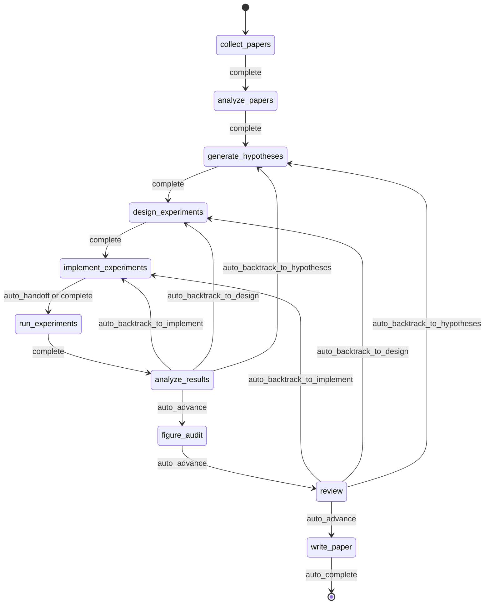

<div align="center">

  <br/>

  

  <h1>Codex-Native Research Governance Layer</h1>

  <p><strong>Evidence gates for Codex and external research agents.</strong><br/>
  Governed, checkpointed, inspectable research work from brief to paper-readiness review.</p>

  <p>
    <a href="./README.md"><strong>English</strong></a>
    &nbsp;&middot;&nbsp;
    <a href="./docs/README.ko.md"><strong>한국어</strong></a>
    &nbsp;&middot;&nbsp;
    <a href="./docs/README.ja.md"><strong>日本語</strong></a>
    &nbsp;&middot;&nbsp;
    <a href="./docs/README.zh-CN.md"><strong>简体中文</strong></a>
    &nbsp;&middot;&nbsp;
    <a href="./docs/README.zh-TW.md"><strong>繁體中文</strong></a>
    &nbsp;&middot;&nbsp;
    <a href="./docs/README.es.md"><strong>Español</strong></a>
    &nbsp;&middot;&nbsp;
    <a href="./docs/README.fr.md"><strong>Français</strong></a>
    &nbsp;&middot;&nbsp;
    <a href="./docs/README.de.md"><strong>Deutsch</strong></a>
    &nbsp;&middot;&nbsp;
    <a href="./docs/README.pt.md"><strong>Português</strong></a>
    &nbsp;&middot;&nbsp;
    <a href="./docs/README.ru.md"><strong>Русский</strong></a>
  </p>

  <p><sub>Localized README files are maintained translations of this document. The English README is updated first.</sub></p>

  <p>
    <a href="https://github.com/lhy0718/AutoLabOS/actions/workflows/ci.yml">
      
    </a>
    <a href="https://github.com/lhy0718/AutoLabOS/actions/workflows/smoke.yml">
      
    </a>
    
  </p>

  <p>
    
    
    
  </p>

  <p>
    
    
    
    
  </p>

</div>

---

AutoLabOS is a Codex-native governance harness for research execution. It treats Codex and external research agents as execution engines, while AutoLabOS owns the artifact, gate, review, downgrade, and paper-readiness contract.

The reference TUI/web workflow remains inspectable end to end: literature collection, hypothesis formation, experiment design, execution, analysis, figure audit, review, and manuscript drafting all produce auditable artifacts. Claims stay evidence-bounded through a claim ceiling. Review is a structural gate, not a polish pass.

Quality assumptions are turned into explicit checks. Real behavior matters more than prompt-level appearance. Reproducibility is enforced through artifacts, checkpoints, and inspectable transitions.

---

## Codex Plugin Direction

AutoLabOS is moving to a plugin-first public surface. The repo-local plugin bundle lives at `plugins/autolabos-research-governor/` and exposes the governance layer as Codex skills rather than as a monolithic autonomous scientist.

The plugin contract is artifact-first:

`ResearchBrief` -> `EvidenceBundle` -> `GateReport` -> `ReviewReport` -> `MetaHarnessPatchPlan` -> `PaperReadinessBundle`

The existing standalone TUI and web app stay important as a reference workflow, compatibility shell, and validation environment. They are no longer the only product shape: external agents can execute work, then AutoLabOS audits the resulting artifacts before any paper-readiness claim is allowed.

For first-run plugin checks:

```sh
npm run plugin:contract
npm run plugin:dogfood
npm run plugin:doctor
npm run plugin:doctor -- --strict
npm run plugin:discovery-check
npm run validate:plugin-bridge
npm run validate:plugin-bridge:local
npm run validate:plugin-faults
npm run validate:plugin-hermetic
npm run validate:plugin-operations
npm run validate:plugin-operations:local
npm run plugin:sync-cache
npm run plugin:release-check
npm run plugin:research -- --check
npm run plugin:research -- verify-pack --root <paper-readiness-bundle-dir>
```

Use `npm run plugin:doctor -- --strict` for CI or release checks that should fail on installed cache drift. Use `npm run plugin:discovery-check` on a Codex-enabled workstation to verify local discovery, enablement, manifest version, repository source, cache, and skill alignment. Use `npm run validate:plugin-bridge` for the deterministic CI-safe bridge acceptance and `npm run validate:plugin-bridge:local` to execute the same governed chain through the installed Codex plugin cache. Use `npm run validate:plugin-faults` for deterministic blocking-path coverage, `npm run validate:plugin-hermetic` for an isolated cache lifecycle, `npm run validate:plugin-operations` for the CI aggregate, and `npm run validate:plugin-operations:local` for the workstation aggregate. Use `npm run plugin:sync-cache -- --write` only when intentionally refreshing the local Codex installation, then run `npm run plugin:release-check`. The plugin-specific onboarding note is `plugins/autolabos-research-governor/README.md`.

See `docs/codex-plugin-governance.md` for the plugin architecture and adapter strategy.

## Why AutoLabOS Exists

Most research-agent systems are optimized around producing text. AutoLabOS is optimized around running a governed research process.

That difference matters when a project needs more than a plausible-looking draft:

- a research brief that acts as an execution contract
- explicit workflow gates instead of open-ended agent drift
- checkpoints and artifacts that can be inspected after the fact
- review that can stop weak work before manuscript generation
- failure memory so the same failed experiment is not repeated blindly
- evidence-bounded claims rather than prose that outruns the data

AutoLabOS is for teams that want autonomous help without giving up auditability, backtracking, or validation.

---

## What Happens In The Reference Workflow

The reference workflow follows the same research arc every time:

`Brief.md` → literature → hypothesis → experiment design → implementation → execution → analysis → figure audit → review → manuscript

In practice:

1. `/new` creates or opens a research brief.
2. `/brief start --latest` validates the brief, snapshots it into the run, and launches a governed run.
3. The system moves through the fixed research workflow, checkpointing state and artifacts at each boundary.
4. Weak evidence triggers backtracking or downgrade instead of automatic polishing.
5. If the review gate passes, `write_paper` drafts a manuscript from bounded evidence.

In the current runtime, `figure_audit` sits between `analyze_results` and `review` so figure-quality critique can checkpoint and resume independently.



All automation inside that flow is bounded inside node-internal loops. The workflow stays governed even in unattended modes.

---

## What You Get After A Run

AutoLabOS does not just emit a PDF. It emits a traceable research state.

| Output | What it contains |
|---|---|
| **Literature corpus** | Collected papers, BibTeX, extracted evidence store |
| **Hypotheses** | Literature-grounded hypotheses with skeptical review |
| **Experiment plan** | Governed design with contract, baseline lock, and consistency checks |
| **Executed results** | Metrics, objective evaluation, failure memory log |
| **Result analysis** | Statistical analysis, attempt decisions, transition reasoning |
| **Figure audit** | Figure lint, caption/reference consistency, optional vision critique summary |
| **Review packet** | 5-specialist panel scorecard, claim ceiling, pre-draft critique |
| **Manuscript** | LaTeX draft with evidence links, scientific validation, optional PDF |
| **Checkpoints** | Full state snapshots at every node boundary — resume anytime |

Everything lives under `.autolabos/runs/<run_id>/`, with public-facing outputs mirrored to `outputs/`.

That is the reproducibility model: artifacts, checkpoints, and inspectable transitions rather than hidden state.

---

## Quick Start

```bash
# 1. Install and build
npm install
npm run build
npm link

# 2. Move to a research workspace
cd /path/to/your-research-workspace

# 3. Launch one interface
autolabos        # TUI
autolabos web    # Web UI
```

Typical first-use flow:

```bash
/new
/brief start --latest
/doctor
```

Notes:

- Both UIs guide onboarding if `.autolabos/config.yaml` does not exist yet.
- TUI and Web UI share the same runtime, artifacts, and checkpoints.
- `/doctor` and the Web Doctor tab's default refresh perform local environment
  and workspace checks without sending a live Codex chat or generation
  request. Existing non-generation checks may still query a configured local
  runtime for health or model availability. To verify the configured Codex chat
  route, run the exact TUI command
  `/doctor --live-provider` or use the explicit live-provider action in the Web
  Doctor tab. That opt-in check sends one fixed, non-user chat request, performs
  no retry, and may consume provider quota. It reports only a bounded status and
  does not persist response output, response bodies, or credentials.
- If the Web UI is exposed through an HTTPS tunnel, set
  `AUTOLABOS_WEB_TRUSTED_ORIGIN` to the exact browser-facing origin (for
  example, `https://research.example.org`) before launch so the explicit probe
  POST can pass the Origin guard without trusting forwarded-protocol headers.

### Isolated Docker Execution

For paper-facing command execution, configure an image that contains the
experiment dependencies, `/usr/bin/env`, and `/bin/sh`:

```bash
AUTOLABOS_DOCKER_IMAGE=your-versioned-research-image:tag
npm run validation:docker-envelope

# Optional exact NVIDIA selection
npm run validation:docker-envelope -- --gpu-ids 0
```

AutoLabOS creates a fresh, read-only, capability-dropped container for each
execution envelope, mounts only the workspace and declared writable roots,
applies the declared network and device policy, verifies the boundary before
and after execution, and removes the container. The receipt preserves hashed
pre/post boundary fingerprints, stability, immutable-image, and cleanup
evidence without exposing inspected host mount paths. The older
`DOCKER=<running-container>` configuration remains available for compatibility
but cannot provide per-envelope mounts or device assignments.

Paper-facing envelopes must bind `AUTOLABOS_DOCKER_IMAGE` to an immutable
`sha256:...` image ID or `name@sha256:...` digest. Mutable tags run only as
non-paper-grade diagnostics. Workspace `.env` files are masked in ephemeral
containers. When an experiment needs a provider credential, point
`AUTOLABOS_DOCKER_SECRET_FILE` to a credential-only regular file outside the
workspace; the primary experiment receives it read-only at
`/run/secrets/autolabos.env`, while the host path and value stay out of the
envelope artifact. The file must be owned by the current user with no group or
other permissions, and the experiment command must explicitly reference the
container target under a declared `remote_inference` network purpose. The
adapter binds the secret content in memory, mounts a private 0400 snapshot
instead of the original pathname, and removes that snapshot after container
cleanup. Dotenv paths are scanned recursively, including dependency and Git
metadata directories; a dotenv symlink blocks execution.

### Full-Text Literature Evidence

Topic and review artifacts can use a portable primary-source manifest that
binds canonical URLs, first-page titles, PDF hashes and sizes, inspected
locations, absorbed claims, unresolved scope, and the residual claim ceiling.
The generic validator rejects abstract-only verification, missing closest-prior
roles, title mismatches, duplicate sources, and developer-machine paths:

```bash
npm run validation:literature-evidence -- \
  --manifest path/to/full-text-manifest.json

# Require and recompute hashes against a local, uncommitted PDF cache.
npm run validation:literature-evidence -- \
  --manifest path/to/full-text-manifest.json \
  --source-dir path/to/pdf-cache \
  --require-source-cache
```

The manifest is evidence provenance, not an automatic novelty verdict. Search
results, abstracts, and agent agreement cannot close the residual-claim gate.

### Prerequisites

| Item | When needed | Notes |
|---|---|---|
| Node.js 22, 24, or 26 | Required | Supported release lines are enforced by the package engine and CI compatibility matrix |
| `SEMANTIC_SCHOLAR_API_KEY` | Recommended | Higher-capacity Semantic Scholar discovery and metadata access |
| `OPENALEX_API_KEY` | Recommended | Authenticated OpenAlex discovery; avoids unauthenticated rate limits |
| `OPENAI_API_KEY` | When provider is `api` | OpenAI API model execution |
| Codex CLI login | When provider is `codex` | Uses your local Codex session |

---

## Research Brief System

The brief is not just a startup note. It is the governed contract for a run.

`/new` creates or opens `Brief.md`. For a new human-authored TUI brief, the guided interview tracks field coverage: one answer can state the topic, metric, comparator, data, and constraints together, and already covered fields are skipped. The WebUI `New run` panel uses the same shared coverage engine through a bounded server-owned interview; it shows the current unanswered question and creates no run until a complete generated brief is ready for review. Ambiguous answers receive a focused follow-up, while source-grounded extraction failure falls back to the current field only. TUI/WebUI show a bounded fallback reason such as provider request rejection or invalid schema without exposing raw provider errors, model output, or operator answers. Unfinished Web interview drafts are process-local and reset when the Web server restarts. File-driven interview automation keeps the historical positional question contract for reproducible fixtures. `/brief start --latest` validates the brief, snapshots it into the run, and starts execution from that snapshot. The run records the brief source path, the snapshot path, and any parsed manuscript format so the provenance of the run remains inspectable even if the workspace brief changes later.
`Appendix Preferences` can now be structured with `Prefer appendix for:` and `Keep in main body:` so appendix-routing intent is explicit in the brief contract.

That makes the brief part of the audit trail, not just part of the prompt.

In practice, `.autolabos/config.yaml` holds provider and workspace defaults, while the brief carries run-specific research intent, evidence bars, baseline expectations, manuscript-format targets, and manuscript template path.

```bash
/new
/brief start --latest
```

Briefs are expected to define both research intent and governance constraints: research mode, topic, objective metric, baseline or comparator, minimum acceptable evidence, disallowed shortcuts, and the paper ceiling if evidence remains weak. In `topic_discovery`, these sections define the search scope and candidate-admissibility rules; each shortlisted candidate supplies its own final metric, explicit unit and numeric scale, direction, structured effect criterion, comparator, data scope, and falsifier before a bounded probe can run.

<details>
<summary><strong>Brief sections and grading</strong></summary>

| Section | Status | Purpose |
|---|---|---|
| `## Research Mode` | Optional | `hypothesis_test` by default, or `topic_discovery` for governed topic search |
| `## Topic` | Required | Research question in 1-3 sentences |
| `## Objective Metric` | Required | Final success metric, or topic-promotion objective in discovery mode |
| `## Constraints` | Recommended | Compute budget, dataset limits, reproducibility rules |
| `## Plan` | Recommended | Step-by-step experiment plan |
| `## Target Comparison` | Governance | Proposed method vs. explicit baseline |
| `## Minimum Acceptable Evidence` | Governance | Minimum effect size, fold count, decision boundary |
| `## Disallowed Shortcuts` | Governance | Shortcuts that invalidate results |
| `## Paper Ceiling If Evidence Remains Weak` | Governance | Maximum paper classification if evidence is insufficient |
| `## Manuscript Format` | Optional | Column count, page budget, reference/appendix rules |

| Grade | Meaning | Paper-scale ready? |
|---|---|---|
| `complete` | Core + 4+ governance sections substantive | Yes |
| `partial` | Core complete + 2+ governance | Proceed with warnings |
| `minimal` | Only core sections | No |

</details>

---

## Two Interfaces, One Runtime

AutoLabOS has two front ends over the same governed runtime.

| | TUI | Web UI |
|---|---|---|
| Launch | `autolabos` | `autolabos web` |
| Interaction | Slash commands, natural language | Browser dashboard and composer |
| Workflow view | Real-time node progress in terminal | Governed workflow graph with actions |
| Artifacts | CLI inspection | Inline preview for text, images, PDFs |
| Operations surfaces | `/watch`, `/queue`, `/explore`, `/doctor` | Jobs queue, live watch cards, exploration status, diagnostics |
| Best for | Fast iteration and direct control | Visual monitoring and artifact browsing |

The important constraint is that both surfaces see the same checkpoints, the same runs, and the same underlying artifacts.

---

## What Makes AutoLabOS Different

AutoLabOS is designed around governed execution rather than prompt-only orchestration.

| | Typical research tools | AutoLabOS |
|---|---|---|
| Workflow | Open-ended agent drift | Governed fixed graph with explicit review boundaries |
| State | Ephemeral | Checkpointed, resumable, inspectable |
| Claims | As strong as the model will generate | Bounded by evidence and a claim ceiling |
| Review | Optional cleanup pass | Structural gate that can block writing |
| Failures | Forgotten and retried | Fingerprinted in failure memory |
| Interfaces | Separate code paths | TUI and Web share one runtime |

This is why the system reads more like research infrastructure than a paper generator.

---

## Core Guarantees

### Governed Workflow

The workflow is bounded and auditable. Backtracking is part of the contract. Results that do not justify forward motion are sent back to hypotheses, design, or implementation rather than polished into stronger prose.

### Checkpointed Research State

Every node boundary writes state you can inspect and resume. The unit of progress is not only text output. It is a run with artifacts, transitions, and recoverable state.

### Claim Ceiling

Claims are kept under the strongest defensible evidence ceiling. The system records blocked stronger claims and the evidence gaps required to unlock them.

### Review As A Structural Gate

`review` is not a cosmetic cleanup stage. It is where readiness, methodology sanity, evidence linkage, writing discipline, and reproducibility handoff are checked before manuscript generation.

### Failure Memory

Failure fingerprints are persisted so structural errors and repeated equivalent failures are not retried blindly.

### Reproducibility Through Artifacts

Runs stay inspectable because the system persists artifacts, checkpoints, and transitions instead of relying on hidden state.

For a history-free release of the reviewed current revision, follow
[`docs/public-source-release.md`](docs/public-source-release.md). A source
snapshot and cleanup of an existing public Git history are separate operations.


---

## Quality Model

AutoLabOS makes quality checks visible during a run.

- `/doctor` checks local environment and workspace readiness before a run starts
  without sending a live Codex chat or generation request; configured local
  runtime health and model-availability checks may still run
- `/doctor --live-provider`, or the explicit Web Doctor action, makes one fixed
  Codex chat request against the configured `chat_model` (falling back to
  `model` only when `chat_model` is absent) and reports a bounded compatibility
  status without retrying or persisting provider output, response bodies, or
  credentials

The opt-in live check establishes only that one bounded chat request is
compatible with the current route. It does not establish research execution,
PDF generation, sustained-run reliability, or paper readiness.

Paper readiness is not a single binary prompt judgment.

- **Layer 1 - deterministic minimum gate** blocks under-evidenced work with explicit artifact and evidence-integrity checks
- **Layer 2 - LLM paper-quality evaluator** adds structured critique over methodology, evidence strength, writing structure, claim support, and limitations honesty
- **Review packet + specialist panel** determine whether the manuscript path should advance, revise, or backtrack

`paper_readiness.json` can include an `overall_score`. It should be read as a run-quality signal inside the system, not as a universal scientific benchmark. Some advanced evaluation and self-improvement flows use that score to compare runs or candidate prompt mutations.

---

## Advanced Self-Improvement Capabilities

AutoLabOS includes bounded self-improvement paths, but they are governed by validation and rollback rather than blind autonomous rewriting.

### `autolabos meta-harness`

`autolabos meta-harness` builds a context directory from recent completed runs and evaluation history under `outputs/meta-harness/<timestamp>/`.

It can include:

- filtered run events
- node artifacts such as `result_analysis.json` or `review/decision.json`
- `paper_readiness.json`
- `outputs/eval-harness/history.jsonl`
- current `node-prompts/` files for the targeted node

The LLM is instructed through `TASK.md` to return only `TARGET_FILE + unified diff`, and the target is constrained to `node-prompts/`. In apply mode, the candidate must pass validation checks; otherwise the change is rolled back and an audit log is written. `--no-apply` builds context only. `--dry-run` shows the diff without modifying files.

### `autolabos evolve`

`autolabos evolve` runs a bounded mutation-and-evaluation loop over `.codex` and `node-prompts`.

- supports `--max-cycles`, `--target skills|prompts|all`, and `--dry-run`
- reads component scores and artifact-backed process checks from the eval harness and `run_status.research_process`; no readiness score is a scientific gate
- can propose bounded prompt and skill mutations, rerun validation, and compare process blockers across cycles
- rolls back regressions by restoring `.codex` and `node-prompts` from the last good git tag

This is a self-improvement path, but not an unconstrained repo-wide rewrite path.

### Harness Preset Layer

AutoLabOS also has built-in harness presets such as `base`, `compact`, `failure-aware`, and `review-heavy`. These adjust artifact/context policy, failure-memory emphasis, prompt policy, and compression strategy for comparative evaluation paths without changing the governed production workflow.

### Reference Claim Review

Citation-bearing claims can be handed to an independent human reviewer without
placing third-party full text in a public packet. The preflight produces a
separate incomplete final-approval template. Only an all-supported review plus
a completed human approval can generate an import-candidate claims TSV:

```sh
autolabos reference-review prepare \
  --claims <refgate_claims.tsv> \
  --status <reference-evidence-status.json> \
  --lock <refgate.lock.json> \
  --out-dir <new-handoff-dir>

autolabos reference-review distribute-private \
  --packet <handoff-dir> \
  --source-dir <citation-key-named-full-text-dir> \
  --out-dir <new-private-distribution-dir>

autolabos reference-review package-private \
  --distribution <private-distribution-dir> \
  --out-dir <new-private-package-dir>

autolabos reference-review verify-private-package \
  --package <private-package-dir>

autolabos reference-review prepare-workspace \
  --package <private-package-dir> \
  --out-dir <new-private-workspace-dir>

autolabos reference-review audit-workspace \
  --workspace <private-workspace-dir> \
  --out-dir <new-workspace-audit-dir>

autolabos reference-review finalize-workspace \
  --workspace <private-workspace-dir> \
  --output <completed-review.json>

autolabos reference-review preflight \
  --packet <handoff-or-private-distribution-dir> \
  --review <completed-review.json> \
  --out-dir <new-preflight-dir>

autolabos reference-review import \
  --packet <handoff-or-private-distribution-dir> \
  --review <completed-review.json> \
  --preflight <new-preflight-dir>/reference-claim-review-preflight.json \
  --approval <completed-final-approval.json> \
  --claims <refgate_claims.tsv> \
  --out-dir <new-import-dir>
```

`package-private` creates a deterministic single-root reviewer archive, binds
its hash and exact file tree in a strict manifest, and verifies the archive from
a fresh extraction. The package still contains third-party full text and remains
private; archive integrity does not establish redistribution permission, human
review, reviewer identity, or claim support. The receiver should rerun
`verify-private-package` on the delivered manifest-and-archive directory.

`prepare-workspace` is an optional private reviewer aid that verifies and
extracts the package, then splits the blank return into resumable per-task
files. `audit-workspace` reports structural progress without treating partial
work as evidence. `finalize-workspace` emits a return only after every task
and the human attestation are complete; it never supplies decisions, identity,
attestation, final approval, claim status, or Refgate acceptance.

The import revalidates the closed packet, review, preflight, approval, and
original claims hash. It writes `refgate_claims.reviewed.tsv` and a hash-bound
receipt to a new directory; it never overwrites the source claims file. Claims
omitted because their full text is missing remain unchecked. The candidate TSV
must pass a separate Refgate submission audit before it is adopted.

### Research Milestone Verification

Long-running research can bind its final requirements to a declarative artifact
contract instead of inferring completion from workflow state:

```sh
autolabos research verify-milestone \
  --contract <milestone.json> \
  --out-dir <new-audit-dir>
```

Each required evidence file must stay inside the declared workspace root and
carry an expected SHA-256 in the contract. Missing, empty, symbolic-link,
unbound, rewritten, or assertion-failing evidence keeps the milestone
incomplete. The report groups failed requirements by their declared workflow
node and exits nonzero until every required item passes.

A passing artifact audit establishes only the declared byte and JSON contracts.
It does not independently prove scientific validity, human identity, provider
identity, or statistical independence.

### Research Validation Profiles

Run a repository-owned, hash-bound command profile when a paper-scale revision
needs one auditable receipt for build, tests, harness, smoke, plugin, environment,
isolated paper-build, and page-render checks:

```sh
autolabos research run-validation \
  --profile <validation-profile.json> \
  --out-dir <new-validation-dir>
```

Profiles declare every required step as a command plus argument vector; shell
strings and undeclared environment overrides are not used. The runner records
the profile hash, exit code, timeout, duration, stdout/stderr hashes, declared
output hashes, and Git state before and after execution. Missing required steps,
missing outputs, command failures, a changed Git HEAD, or a dirty worktree keep
the report failed. Command success establishes only the declared validation
surface and never substitutes for scientific, human-review, licensing,
reference, or paper-readiness evidence.

Milestone contracts can bind a final receipt without creating a Git-hash cycle
by setting `verifier` to `research_validation_report` and `sha256` to `null`.
This verifier does not trust a claimed `passed` field alone: it re-hashes the
current profile, requires the recorded clean and stable HEAD to equal the
current repository HEAD, and re-hashes every recorded stream and expected
output. The profile runner must write the report directly to the path declared
by the milestone contract; a hand-written claimed-pass receipt without the
bound profile, repository state, logs, and outputs is not equivalent.

---

## Common Commands

| Command | Description |
|---|---|
| `/new` | Create or open `Brief.md` |
| `/brief start <path\|--latest>` | Start research from a brief |
| `/runs [query]` | List or search runs |
| `/resume <run>` | Resume a run |
| `/agent run <node> [run]` | Execute from a graph node |
| `/agent status [run]` | Show node statuses |
| `/agent overnight [run]` | Run unattended with conservative bounds |
| `/agent autonomous [run]` | Run open-ended bounded research exploration |
| `/watch` | Live watch view for active runs and background jobs |
| `/explore` | Show exploration-engine status for the active run |
| `/queue` | Show running, waiting, and stalled jobs |
| `/doctor [--live-provider]` | Local diagnostics, with an explicit one-request Codex chat compatibility check |
| `/model` | Switch model and reasoning effort |

<details>
<summary><strong>Full command list</strong></summary>

| Command | Description |
|---|---|
| `/help` | Show command list |
| `/new` | Create or open workspace `Brief.md` |
| `/brief start <path\|--latest>` | Start research from workspace `Brief.md` or a brief path |
| `/doctor [--live-provider]` | Local diagnostics, with an explicit one-request Codex chat compatibility check |
| `/runs [query]` | List or search runs |
| `/run <run>` | Select run |
| `/resume <run>` | Resume run |
| `/agent list` | List graph nodes |
| `/agent run <node> [run]` | Execute from node |
| `/agent status [run]` | Show node statuses |
| `/agent collect [query] [options]` | Collect papers |
| `/agent recollect <n> [run]` | Collect additional papers |
| `/agent focus <node>` | Move focus with safe jump |
| `/agent graph [run]` | Show graph state |
| `/agent resume [run] [checkpoint]` | Resume from checkpoint |
| `/agent retry [node] [run]` | Retry node |
| `/agent jump <node> [run] [--force]` | Jump node |
| `/agent overnight [run]` | Overnight autonomy (24h) |
| `/agent autonomous [run]` | Open-ended autonomous research |
| `/model` | Model and reasoning selector |
| `/approve` | Approve paused node |
| `/queue` | Show running / waiting / stalled jobs |
| `/watch` | Live watch view for active runs |
| `/explore` | Show exploration-engine status |
| `/retry` | Retry current node |
| `/settings` | Provider and model settings |
| `/quit` | Exit |

</details>

---

## Who This Is For / Not For

### Good fit

- teams that want autonomous help with a governed workflow
- research engineering work where checkpoints and artifacts matter
- paper-scale or paper-adjacent projects that need evidence discipline
- environments where review, traceability, and resumability matter as much as generation

### Not a good fit

- users who only want a fast one-shot draft
- workflows that do not need artifact trails or review gates
- projects that want free-form agent behavior more than governed execution
- cases where a simple literature summary tool is enough

---

## Status

AutoLabOS is an active OSS research-engineering project. For deeper details beyond this overview, see the documents under docs.
